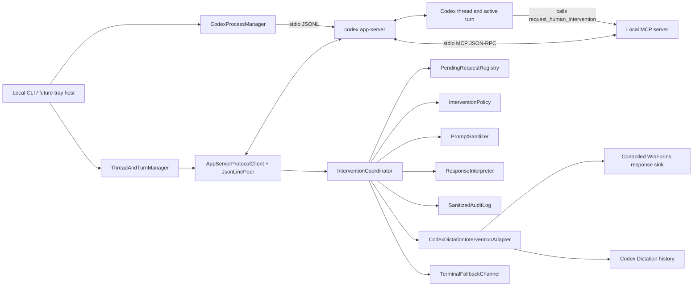
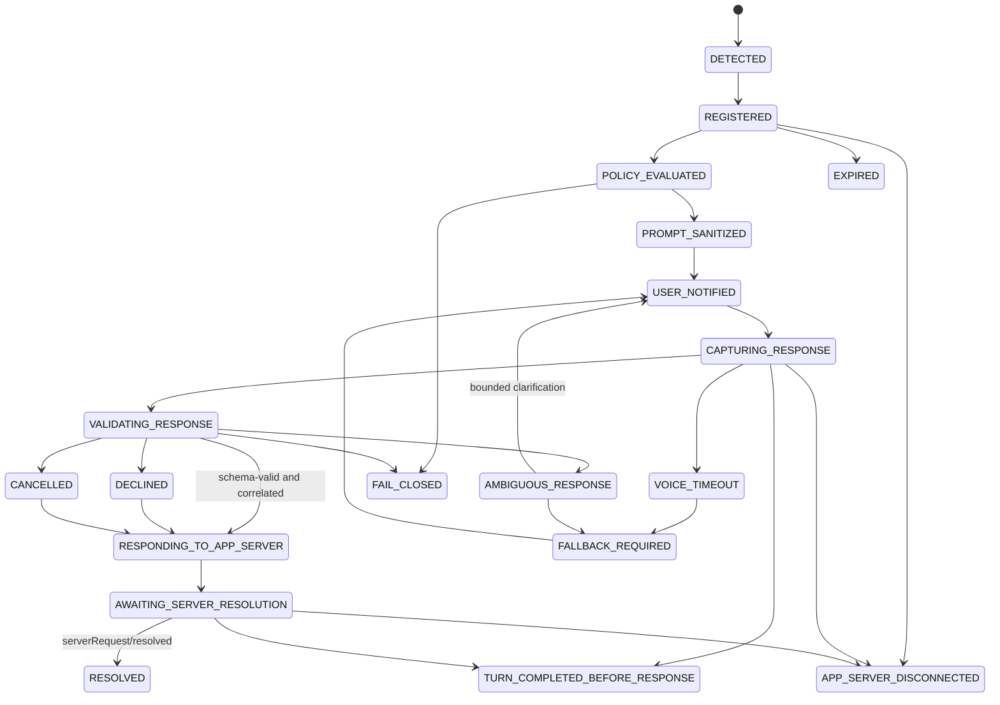
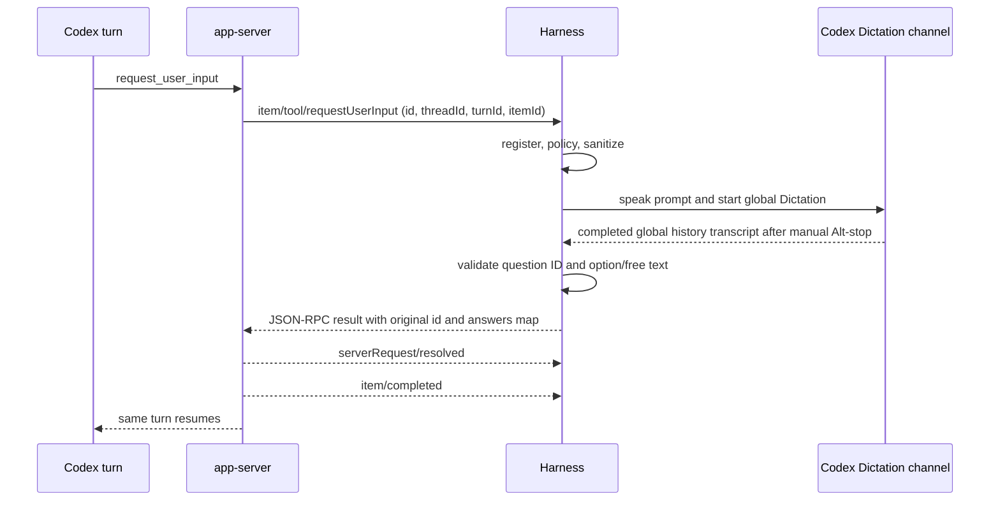
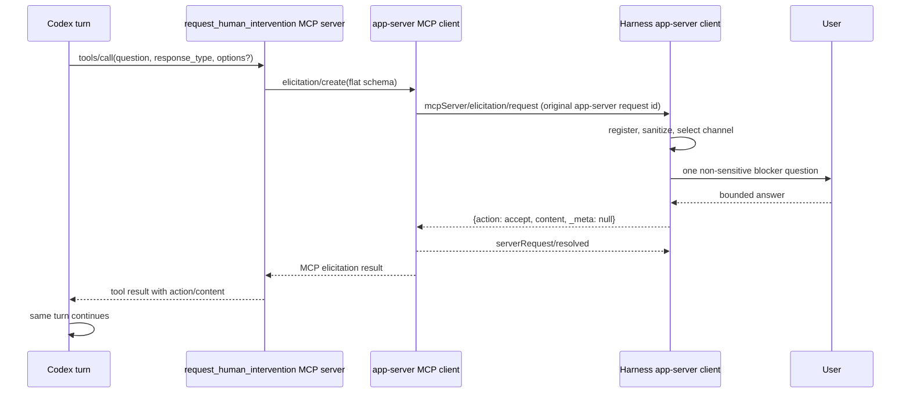
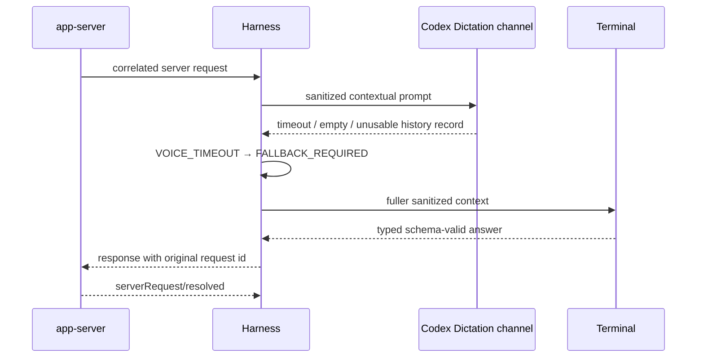
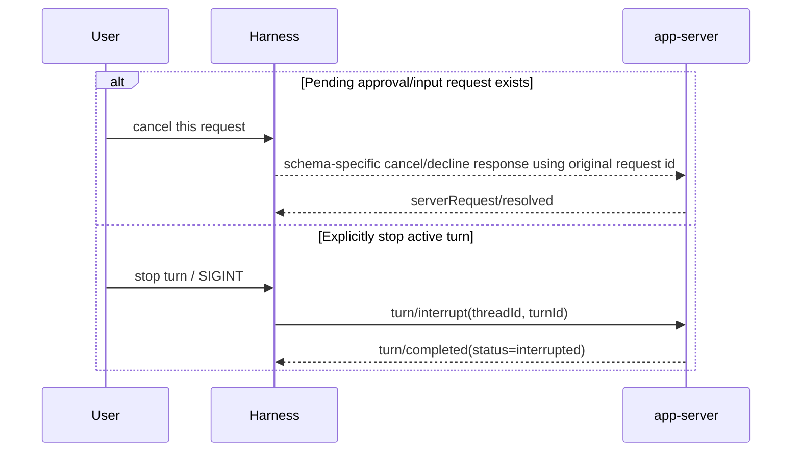

# Codex Human Intervention Harness — High-Level Design

Status: implemented MVP and live-verified on Windows, 2026-08-11.

Voice-channel update: Codex Dictation with manual `Alt+N` stop is now the default. The original loopback faster-whisper bridge described below remains available through `--voice-mode local`.

## 1. Scope and decision

This is a thin local host around the official Codex app-server protocol. It is not a framework-neutral agent platform and does not replace Codex approvals, sandboxing, or task execution. Codex remains the system of execution; the harness owns transport, correlation, user-notification policy, answer validation, and safe delivery of the response expected by app-server.

The primary use case is computer-use and browser automation. The same boundary also handles ordinary command/file/permission approvals, bounded clarification, authentication handoff, and other human-authority decisions.

The Default-mode blocker primitive is a local MCP tool named `request_human_intervention`. The installed app-server schema marks `item/tool/requestUserInput` experimental, and a live Default-mode turn reported that `request_user_input` was unavailable. MCP standard form elicitation is therefore the reliable Default-mode path; native request-user-input remains supported whenever Codex emits it.

## 2. Evidence classification

| Classification | Evidence |
|---|---|
| Verified installed protocol | Schemas were generated from `codex-cli 0.147.0-alpha.6.5`; the live host completed initialization, thread start, turn start, MCP elicitation, correlated response, `serverRequest/resolved`, continued the same turn, and received `turn/completed`. |
| Verified voice behavior | The default controlled-window flow speaks through Windows SAPI, starts Codex global Dictation, accepts manual `Alt+N` stop, and recovers a new completed global history transcript. The existing loopback faster-whisper bridge remains an opt-in fallback. |
| Implemented in this repository | JSONL peer, process lifecycle, thread/turn facade, request registry, policy, sanitization, voice adapter, terminal fallback, schema-bound interpreter, audit log, MCP server, CLI, and deterministic tests. |
| Proposed hardening | Durable restart recovery, desktop/tray UI, a secure typed secret-entry channel, richer voice confidence, and broader live approval fixtures. These are not claimed as MVP behavior. |

## 3. Legacy voice bridge assessment

The inspected implementation is reusable without redesign:

- `ask-native-voice.ps1` is a CLI/bootstrap boundary.
- `native_server.py` owns the loopback HTTP service at `127.0.0.1:8766`.
- `native_voice.py` owns SAPI speech, the notification tone, physical-microphone capture, and local faster-whisper transcription.
- The device is explicitly selected rather than trusting a virtual/default microphone.
- Speech and transcription remain local.

The harness calls `/health`, then `/ask`. If the service is unavailable and a launcher path was supplied, it invokes `ask-native-voice.ps1` with a process-scoped PowerShell execution-policy bypass; it does not change machine policy. Voice requests are serialized to avoid overlapping SAPI/audio capture.

Integration boundaries and limitations:

- The returned transcript is kept in memory only long enough to validate and answer the pending request.
- Raw audio and transcript text are not written to the harness audit log.
- The bridge currently has no confidence field. Ambiguity is handled through exact vocabulary/schema validation, bounded retry, and text fallback—not invented confidence.
- Login, MFA, CAPTCHA, URL handoffs, and secret fields are visual/terminal-only. The harness may announce that a visual handoff is required, but never asks the user to speak a credential or code.

## 3.1 Codex Dictation channel

The default intervention channel reuses Codex Dictation without private renderer hooks:

- `capture-codex-dictation.ps1` opens a top-most controlled textbox before starting Dictation, preventing the global completion paste from landing in a browser form or Codex composer.
- Windows SAPI speaks the sanitized, context-specific blocker question and then sends the configured global shortcut (`Alt+N` on this machine) to start Dictation.
- The user speaks normally and presses `Alt+N` once to stop. No Enter key is required.
- The channel baselines both `%USERPROFILE%\.codex\dictation-history` and `transcription-history.jsonl`, then accepts only a new, non-empty completed global record created after its prompt.
- It waits through the observed state where metadata can be completed before transcript text is populated. The controlled paste is a secondary recovery source; rich history is checked first.
- Voice sessions are serialized so two pending App Server requests cannot share one global microphone session.

Raw audio and transcript text are never copied into the harness audit. Codex Dictation itself retains its normal audio/transcript history, which is an explicit privacy boundary of this design. Secret fields, credentials, OTPs, government identifiers, payment details, and URL authentication remain non-voice.

## 4. Architecture



Trust boundaries:

1. Codex/app-server is authoritative for thread, turn, item, approval, permission, and sandbox semantics.
2. The harness is authoritative for pending-request correlation and human-channel safety.
3. The MCP server is intentionally narrow: one tool, one short non-sensitive question, one flat MCP form.
4. The existing voice bridge is an adapter, not a second agent or policy engine.

## 5. Codex app-server integration boundary

The host uses stdio JSONL. Every line is one JSON-RPC message. Client requests get monotonically assigned IDs. Incoming messages are classified as:

- response: `id`, no `method`;
- server-initiated request: `id` and `method`;
- notification: `method`, no `id`.

Lifecycle:

1. Spawn `codex app-server`.
2. Send `initialize` with client info and capabilities.
3. Send `initialized` notification.
4. Call `thread/start` or `thread/resume`.
5. Call `turn/start` and continuously consume events.
6. For a supported server request, save its original ID and correlation fields before notifying the user.
7. Respond with a JSON-RPC result using that original server-request ID.
8. Treat `serverRequest/resolved` as the clearing confirmation.
9. Continue consuming `item/completed` and `turn/completed`.

Control semantics:

- `turn/steer` adds unstructured guidance only when an active turn exists and no specific server request is awaiting a schema-bound response. `expectedTurnId` prevents cross-turn steering.
- `turn/interrupt` cancels an active turn. It is used for explicit stop/SIGINT or a deliberate fail-closed cancellation, never as a pause primitive.
- A pending approval, input, permission, or elicitation is resumed by responding to its original request ID—not by steering or interrupting.

Official references: [Codex app-server](https://learn.chatgpt.com/docs/app-server), [Codex MCP configuration](https://learn.chatgpt.com/docs/extend/mcp), and [MCP elicitation](https://modelcontextprotocol.io/specification/2025-06-18/client/elicitation).

## 6. Components and implemented files

| Component | Responsibility | Implementation |
|---|---|---|
| `CodexProcessManager` | Start/monitor app-server, preserve stdio, forward stderr, graceful shutdown. On Windows, use a fixed PowerShell launcher because Microsoft Store ACLs can reject direct child-process creation. | `src/process-manager.ts`, `scripts/start-app-server.ps1` |
| `AppServerProtocolClient` | Initialize, assign IDs through the JSONL peer, classify messages, send typed thread/turn requests and correlated responses. | `src/app-server-client.ts`, `src/jsonl-peer.ts` |
| `ThreadAndTurnManager` | Start/resume threads; start, steer, or interrupt the active turn. | `src/thread-turn-manager.ts` |
| `PendingRequestRegistry` | Own exact-once request identity, lifecycle, expiry, duplicate prevention, turn completion, and disconnect invalidation. | `src/pending-request-registry.ts` |
| `InterventionPolicy` | Select voice-first, terminal-only, or fail-closed handling. | `src/intervention-policy.ts` |
| `PromptSanitizer` | Produce separate concise spoken and fuller terminal prompts; redact secret-like values. | `src/prompt-sanitizer.ts` |
| `CodexDictationInterventionAdapter` | Serialize capture, launch the controlled UI, race history and paste recovery, and return transcript/timing. | `src/channels.ts`, `src/codex-dictation-history.ts`, `scripts/capture-codex-dictation.ps1` |
| `VoiceInterventionAdapter` | Retained opt-in adapter for the existing loopback faster-whisper bridge. | `src/channels.ts` |
| `ResponseInterpreter` | Map exact speech/options/free text to generated response shapes; reject ambiguity. | `src/response-interpreter.ts` |
| `FallbackChannel` | Collect an answer through a local terminal when voice is unsafe, unavailable, timed out, or ambiguous. | `src/channels.ts` |
| `SanitizedAuditLog` | Append lifecycle metadata without request bodies, audio, or transcript text. | `src/audit-log.ts` |
| `InterventionCoordinator` | Execute policy, retries/fallback, correlation checks, response, and resolution handling. | `src/intervention-coordinator.ts` |
| Human-intervention MCP server | Expose one allow-listed tool and translate a tool call into standard `elicitation/create`. | `src/mcp-human-intervention-server.ts`, `src/mcp-config.ts` |

MVP restart policy is fail closed: app-server disconnect invalidates all pending requests, and no late answer is reusable. The process may be restarted and a durable Codex thread resumed explicitly, but the harness never silently replays an approval across a connection boundary.

## 7. Correlation model

The generated `RequestId` is the response address on one app-server connection. The registry adds defense-in-depth fields:

```ts
interface Correlation {
  requestId: RequestId;
  threadId: string;
  turnId: string | null;
  itemId: string | null;
}

interface PendingIntervention extends Correlation {
  method: SupportedInterventionMethod;
  createdAtMs: number;
  expiresAtMs: number | null;
  version: number;
  state: InterventionState;
  channel?: "voice" | "terminal";
  decision?: string;
}
```

Rules:

- Key by both ID type and value (`number:0` differs from `string:0`).
- Reject duplicate IDs while the connection is alive.
- Before and after human capture, re-check ID, thread, turn, item, state, version/expiry.
- Never select “the most recent request” as a response target.
- `serverRequest/resolved` must match both `threadId` and request ID.
- `turn/completed` terminalizes every unresolved request correlated to that turn.
- Disconnect terminalizes every unresolved request on the connection.
- Concurrent channels are serialized where hardware requires it, but answers remain bound to their own request object and ID.

## 8. State machine



`DECLINED` and `CANCELLED` are decision states that still require the appropriate schema-valid result to be sent. `RESOLVED` is reached only after app-server confirms the request is cleared.

## 9. Sequence diagrams

### 9.1 Native request-user-input



### 9.2 Command approval

```mermaid
sequenceDiagram
    participant C as Codex turn
    participant A as app-server
    participant H as Harness
    participant U as User via voice/text
    C->>A: command requires approval
    A->>H: item/commandExecution/requestApproval
    H->>U: sanitized action class and workspace; no full command/secrets
    U-->>H: approve once / approve for session / decline / cancel
    H->>H: exact grammar plus correlation check
    H-->>A: {decision: accept | acceptForSession | decline | cancel}
    A-->>H: serverRequest/resolved
    A-->>H: item/completed
```

### 9.3 MCP computer-use intervention



For CAPTCHA/login/MFA/authentication, the tool asks only for a non-sensitive handoff decision such as “I am ready” or presents a visual URL handoff. It must not ask the user to speak the credential, code, or private form value.

### 9.4 Dictation timeout and text fallback



### 9.5 Cancellation



## 10. Method and event matrix

| Flow | Incoming server request | Client response/result | Confirmation/progress |
|---|---|---|---|
| User input | `item/tool/requestUserInput` | Original request ID + `ToolRequestUserInputResponse.answers[questionId]` | `serverRequest/resolved`, `item/completed`, `turn/completed` |
| Command approval | `item/commandExecution/requestApproval` | Original request ID + `{decision}` | same |
| File approval | `item/fileChange/requestApproval` | Original request ID + `{decision}` | same |
| Permission approval | `item/permissions/requestApproval` | Original request ID + `{permissions, scope}` | same |
| MCP intervention | `mcpServer/elicitation/request` | Original request ID + `{action, content, _meta}` | `serverRequest/resolved`, MCP item progress/completion, turn completion |
| Additional guidance | none required; active turn only | `turn/steer(threadId, expectedTurnId, input)` | normal item and turn events |
| Explicit stop | none required; active turn only | `turn/interrupt(threadId, turnId)` | `turn/completed` with interrupted status |

The installed generated request union contains no separate app-tool approval method. If an app or MCP invocation produces one of the built-in approval request types above, it is handled by that type. A newly introduced method fails closed until schemas are regenerated and policy is added.

## 11. Response model

- Command/file approval: exact phrases map to `accept`, `acceptForSession`, `decline`, or `cancel`. A generic “yes” is ambiguous, not approval.
- Permissions: accept returns only the network/file-system permission profile app-server requested; scope is `turn` or `session`. The harness never adds a permission.
- Native user input: one question per voice exchange; the answer is keyed by generated question ID. Secret questions are terminal-only.
- MCP form: MVP supports one flat string, enum, or boolean field. Accept includes schema-valid content; decline/cancel omit content.
- URL/OpenAI-extended form: terminal/visual only. The MVP does not opt into OpenAI-extended forms.
- Unknown methods: JSON-RPC method-not-supported error and a sanitized fail-closed audit event.

## 12. Security and prompt sanitization

Controls are layered:

1. Policy routing blocks secret/native-secret questions and URL/auth handoffs from voice.
2. MCP tool input rejects secret/credential/token/password/OTP requests before elicitation.
3. Spoken prompt construction uses action class, basename of workspace, short reason/question, and bounded options. It omits full commands, patches, proprietary file contents, full paths, raw form values, and policy payloads.
4. Regex redaction removes common API keys, bearer values, secret assignments, and six-digit codes.
5. The terminal view can show more context but remains sanitized and local.
6. Exact response grammar and generated schemas prevent vague speech from becoming authority.
7. Correlation is revalidated after capture, before sending.
8. The append-only audit stores identifiers, request type, state, channel, decision, and time—but not raw request bodies, audio, or transcript text.
9. Failure, uncertainty, expiry, turn completion, or disconnect makes the answer unusable.

## 13. Repository structure

```text
codex-human-intervention-harness/
├── docs/
│   ├── HIGH_LEVEL_DESIGN.md
│   ├── IMPLEMENTATION_PLAN.md
│   └── LIVE_VERIFICATION.md
├── schemas/
│   ├── json/                 # generated by installed codex
│   ├── typescript/           # generated by installed codex
│   └── README.md
├── scripts/
│   └── start-app-server.ps1  # fixed Windows stdio launcher
├── src/
│   ├── app-server-client.ts
│   ├── jsonl-peer.ts
│   ├── process-manager.ts
│   ├── thread-turn-manager.ts
│   ├── pending-request-registry.ts
│   ├── intervention-policy.ts
│   ├── prompt-sanitizer.ts
│   ├── response-interpreter.ts
│   ├── channels.ts
│   ├── audit-log.ts
│   ├── intervention-coordinator.ts
│   ├── mcp-human-intervention-server.ts
│   ├── mcp-config.ts
│   └── cli.ts
└── tests/
    ├── fixtures/
    └── *.test.ts
```

## 14. Non-goals

- No universal or multi-agent intervention framework.
- No Codex internal modification or replacement approval system.
- No remote WebSocket host, cloud transcription, or sophisticated GUI.
- No dynamic-tool dependency; only the generated experimental native user-input path is enabled because it is an explicit requirement and is isolated behind the same typed adapter.
